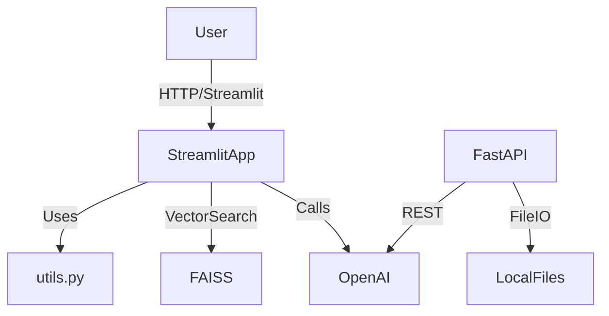

# University Exam Paper Generator

University Exam Paper Generator is a production-ready **Streamlit + FastAPI application** for generating structured university exam papers. It leverages **LangChain**, **OpenAI GPT**, and **FAISS vector stores** to generate fresh questions based on past papers and syllabus content while preserving style, numbering, sections, and marks.

---

## Architecture



---

## Features

- **Structured Question Generation**: Generates exam papers following past paper style and formatting.
- **PDF Export**: Download generated papers as PDFs (requires ReportLab).
- **Multi-type Questions Support**: Handles objective, short answer, long answer, and sub-questions.
- **Vector Search over Past Papers**: Uses FAISS to retrieve relevant questions for generation.
- **Syllabus Integration**: Generates questions based on uploaded syllabus PDF.
- **Streamlit Interface**: Interactive web app for uploading files and generating papers.
- **FastAPI Backend**: Optional programmatic access via API endpoints.
- **Text Cleaning and Formatting**: Preserves marks, numbering, and POM1 style formatting.

---

## Requirements

Install dependencies from requirements.txt:

```bash
pip install -r requirements.txt
```

Optional: Install Tesseract OCR and Poppler for scanned PDFs.

---

## Environment Variables

Create a `.env` file in the project root with:

```ini
OPENAI_API_KEY=your_openai_key
```

---

## Usage

### Streamlit App

Start the app:

```bash
streamlit run app.py
```

**Steps:**

1. Upload syllabus PDF
2. Upload past paper PDFs (multiple allowed)
3. Click Process Files
4. Click Generate Predicted Paper
5. Preview structured output and download as PDF (if ReportLab is installed)

### FastAPI Backend

Start the API server:

```bash
uvicorn api:app --reload
```

**Endpoints:**

- `POST /generate` — Generate a predicted exam paper
- `POST /upload` — Upload syllabus and past paper PDFs for processing

Uses the same utilities (`utils.py`) as the Streamlit app.

---

## Project Structure

```
├── .vscode/               # VSCode config
├── data/                  # Optional data storage
├── faiss_index/           # FAISS vector store for past papers
├── .env.example           # Environment variables template
├── .gitignore
├── LICENSE
├── README.md
├── api.py                 # FastAPI backend
├── app.py                 # Streamlit frontend
├── requirements.txt
└── utils.py               # Core utilities for text extraction, cleaning, vector store, and PDF
```

---

## Example Usage

### Generate Paper via API

```bash
curl -X POST "http://localhost:8000/generate" \
  -H "Content-Type: application/json" \
  -d '{
        "syllabus_text": "<syllabus content>",
        "past_papers_text": "<concatenated past papers text>"
      }'
```

### Streamlit Web App

1. Open browser at `http://localhost:8501`
2. Upload files and click Generate Predicted Paper
3. Download PDF

---

## Error Handling

- If ReportLab is not installed, PDF download is disabled with a warning
- Handles missing or improperly formatted PDF uploads
- All endpoints and app actions provide meaningful messages

---

## Extending the App

- Add new text cleaning or formatting rules in `utils.py`
- Integrate additional LLMs by modifying the generation logic
